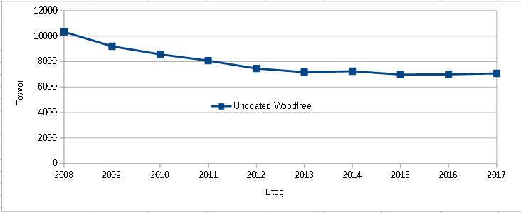

##### HCI on a paperless office : Η σύγκλιση δύο κόσμων και η ιστορία μιας αγάπης που πεθαίνει.

###### ΕΙΣΑΓΩΓΗ

Η γέννηση του "ψηφιακού γραφείου", έχει από δεκαετίες προβλεφθεί( Guimbretière, 2003 ), κυρίως λόγω της αλματώδου τεχνολογικής προόδου, στα πεδία της ηλεκτρονικής και της πληροφορικής. Από τις βασικές αρχές που διέπουν το νέο αυτό κόσμο, είναι η δημιουργία, η διατήρηση και η επεξεργασία, πάσης φύσεως πληροφορίας, ψηφιακά. Στην διαδικασία μετάπτωσης από το φυσικό στο ψηφιακό γραφείο, πρωταγωνιστικό  ρόλο έχει η μέθοδος σύγκλισης των δύο κόσμων (  Dymetman & Copperman, 1998;  Guimbretière, 2003 ). Στην σύγκλιση αυτή, περιλαμβάνεται και η αξιοποίηση της πληροφορίας , που βρίσκεται ήδη αποθηκευμένη σε φυσικό χαρτί, αλλά πιο σημαντικά, περιλαμβάνεται η φυσική ανθρώπινη τάση, στην χρήση του φυσικού χαρτιού, ως το πλέον σύνηθες μέσο αποθήκευσης  της πληροφορίας. Το προαναφερθέν δεν πρέπει μάλλον να μας εκπλήσσει, όταν αντιληφθούμε την χρήση του φυσικού χαρτιού ως μια συνήθεια αποτύπωσης και διαχείρισης της πληροφορίας, με πέντε περίπου εκατονταετίες χρηστικής ωφέλειας ( *η τυπογραφία ξεκίνησε ουσιαστικά το 15ο  αιώνα* ) . 

###### ΤΑ ΧΑΡΑΚΤΗΡΙΣΤΙΚΑ ΤΟΥ ΧΑΡΤΙΟΥ 

Η αποτύπωση της πληροφορίας στο φυσικό χαρτί, παρουσιάζει κάποια πλεονεκτήματα (  Dymetman & Copperman, 1998 ). Μια αυξημένη ικανότητα διατήρησης αναλλοίωτης της πληροφορίας1 , σχετική φορητότητα1 και ως γνήσιο μέλος του φυσικού κόσμου και της καθημερινότητας των χρηστών προσφέρει πραγματικά απτές και διαισθητικές μεθόδους διεπαφής ( Guimbretière, 2003 ).   Από την άλλη πρόκειται αναμφίβολα για ένα στατικό μέσο, χωρίς δυνατότητες ενημέρωσης και μηχανισμούς ταχείας αναζήτησης στην περιεχόμενη πληροφορία. Επιπροσθέτως, το φυσικό χαρτί ως υλικό, είναι ευπαθές και τα κόστη, για την  συντήρηση του, την αποθήκευση του και αντιγραφή,  είναι αυξημένα (Guimbretière, 2003 ; Sellen & Harper, 2003 ).

###### Η ΣΥΓΚΛΙΣΗ ΔΥΟ ΚΟΣΜΩΝ

Στην προσπάθεια γεφύρωσης των δυο κόσμων επικεντρώνεται η μελέτη ενός ευφυούς χαρτιού an intelligent paper(  Dymetman & Copperman, 1998;  Guimbretière, 2003 ). Η ιδέα εδράζεται σε μια μέθοδο μοναδικής σήμανσης2 , του κάθε φύλλου χαρτιού , με ένα μοναδικό κωδικό μεγέθους , 64bit. Κάθε σελίδα διαιρείται σε 256Χ256 διακριτά τμήματα. Κάθε τμήμα της σελίδας, σημαίνεται μοναδικά παγκοσμίως, από ενα κωδικό μεγέθους 64+8bit+8bit=80bit που είναι δυνατόν να ερμηνευθεί και να ταυτιστεί με μια διαδικτυακή διεύθυνση.  Η διεπαφή χρησιμοποιεί ως είσοδο μια ψηφιακή γραφίδα και εκμεταλεύεται την εξοικείωση  του χρήστη με παρόμοια μέσα. Ως αποτέλεσμα η λειτουργικότητα της, γίνεται άμεσα αντιληπτή, αφού η χρήση γραφίδας είναι μέσα στις συνήθεις, καθημερινές ασχολίες μας. Η διεπαφή προσφέρει δυνατότητες επιλογής κειμένου,  εμβάθυνσης στα δεδομένα, επιλογή προβολής συσχετισμένου υλικού, δημιουργία σημειώσεων. Γίνεται  επίσης ένα μέσο αποστολής εντολών σε ένα απομακρυσμένο σύστημα, με στόχο την παραγωγή κάποιου αποτελέσματος. Στο ίδιο πνεύμα αλλά σε μια πιο εξελιγμένη μορφή σύγκλισης και με ένα σχετικώς διαφορετικό τρόπο σήμανσης του χαρτιού,  προτείνεται η μελέτη  Paper augmented digital documents ( Guimbretière, 2003 ). Ο χρήστης μέσω της ψηφιακής γραφίδας αλληλεπιδρά με το φυσικό έγγραφο,  διορθώνει και σημειώνει έγγραφα και αρχιτεκτονικά σχέδια,   που στην συνέχεια συγχρονίζονται με την ψηφιακή τους οντότητα.  Αν και υπήρχαν περιορισμοί στην εκτύπωση της μοναδικής σήμανσης από τους εκτυπωτές της εποχής, οι συγγραφείς παραθέτουν την δυναμική, της επανεκτύπωσης, επεξεργασίας και του επανασυγχρονισμού. 

Στην μελέτη PapierCraft: A Gesture-Based Command System for Interactive Paper  ( Liao, Guimbretière, Hinckley & Hollan, 2008 )  γίνεται μια προσπάθεια ταύτισης των δύο κόσμων. Αυτό επιτυχγάνεται με την επαύξηση των δυνατοτήτων του φυσικού χαρτιού και την δημιουργία μιας αρκετά εξελιγμένης διεπαφής. Η διεπαφή χρησιμοποιεί ως μηχανισμό εισόδου, μια ψηφιακή γραφίδα και ως μέσο ανάδρασης το φυσικό χαρτί. Αυτό  προσφέρει τα πλεονεκτήματα χρήσης του φυσικού χαρτιού και ταυτόχρονα την δυνατότητα ανάκλασης των ενεργειών του χρήστη στην ψηφιακή του υπόσταση.  Η επαύξηση του χαρτιού επιτυγχάνεται μέσα από ένα σύστημα ανίχνευσης θέσης και κινήσεων μέσω της ψηφιακής γραφίδας. Σημαντικό είναι σε αυτό το σημείο να αναφερθεί ότι δεν χρησιμοποιούνται προτυπωμένα σύμβολα εντολών. Ο χρήστης σχεδιάζει  στο φυσικό μέσο σύμβολα τα οποία ως μέλη μιας οπτικής γλώσσας,  ερμηνεύονται ετεροχρονισμένα από το υπολογιστικό σύστημα. Αυτός ο μηχανισμός στην πραγματικότητα, μετατρέπει κάθε σελίδα χαρτιού σε μια κινητή συσκευή αποτύπωσης εντολών. Ο χρήστης είναι σε θέση να εκτελέσει εντολές που συμβατικά μόνο με χρήση κειμενογράφου ήταν εφικτές. Ως δείγμα της αρχής λειτουργίας στην μελέτη περιγράφεται η επιλογή, η αποκοπή και η επικόλληση τμημάτων του εγγράφου, καθώς επίσης και η  συννένωση διαφορετικών εγγράφων, η δημιουργία υπερσυνδέσμων, εντολών ηλεκτρονικής αλληλογραφίας και αναζήτησης στο διαδίκτυο. Όλες αυτές οι λειτουργίες αποτυπώνονται στο φυσικό μέσο και ετεροχρονισμένα ανακλούνται στον ψηφιακό κόσμο. Δυστυχώς βέβαια, ορισμένοι περιορισμοί που εγείρονται από την φύση του χαρτιού είναι ανυπέρβλητοι. Για παράδειγμα, η στατική φύση του φυσικού εγγράφου, δημιουργεί ένα χάσμα στην ροή εργασιών σε περίπτωση που μεταβληθεί το ηλεκτρονικό έγγραφο, αφού οι αλλαγές αυτές, δεν είναι δυνατόν να απεικονιστούν στο φυσικό έγγραφο σε πραγματικό χρόνο. Ένα άλλο πρόβλημα που εγείρεται, είναι η έλλειψη ανάδρασης σε περίπτωση σφάλματος, αφού η διεπαφή δεν προστατεύει τον χρήστη και δεν υποστηρίζει ανάκληση και επανεκτέλεση της πιο πρόσφατης εντολής σε πραγματικό χρόνο. Η μη διαισθητική αντίληψη της διεπαφής εντάσσεται επίσης στα αρνητικά χαρακτηριστικά του συστήματος, εφόσον για την κατανόηση των εντολών, πρέπει απαραιτήτως να προηγηθεί κάποιου  είδους εκπαίδευση.

###### ΕΠΙΛΟΓΟΣ

 "Το σύνταγμά μας βρίσκεται σε λειτουργία. Τα πάντα δείχνουν να υπόσχονται πως θα κρατησει, τίποτα δεν μπορούμε να πούμε πως είναι βέβαιο πέρα από το θάνατο και τους φόρους" 3Βενιαμίν Φραγκλίνος. 

 Πολύ πιθανόν να μην κρίνεται ως βεβαία και απολύτως απαραίτητη η αέναη, καθολική ενοποίηση του φυσικού κόσμου των εγγράφων και του ψηφιακού. Παρόλα αυτά , αδιαμφισβήτητα, είναι ένα απαραίτητο βήμα στην διαδικασία της μετάπτωσης. Στην διαδικασία αυτή σημαντικός παράγοντας επιτυχίας θα είναι και ο σχεδιασμός διεπαφών που θα επιτρέπουν  την διάφανη, απρόσκοπτη αλληλεπίδραση των χρηστών, με στόχο την ταχεία πρόσβαση και διαχείριση της αποθηκευμένης πληροφορίας.

**Η ιστορία μιας αγάπης που πεθαίνει:**

 "Αυτή η υπόθεση κύριε εξηγεί στην ουσία τα πάντα, αλλά δεν μας επιτρέπει να προβλέψουμε τίποτα. Ως μελετητής οφείλω να σας παρέχω έργα που επιτρέπουν τις προβλέψεις." 4 Πιερ Σιμόν Ντε Λαπλάς .

Στο βιβλίο The Myth of Paperless office πολύ εύστοχα επισημαίνεται η μεταβατική δυσκολία  στην υιοθέτηση χρήσης των ψηφιακών εγγράφων από μεγάλη μερίδα χρηστών. Έχω την γνώμη, ότι ως τροχοπέδι έδρασε σε αυτή την μετάβαση, η αδράνεια που χαρακτηριζει τον μέσο άνθρωπο όταν υπόκειται στην επιβαλόμενη μεταβολλή των καθημερινών, μηχανικών, δραστηριοτήτων του αλλά και η έλλειψη της κατάλληλης διεπαφής, των τεχνονολογικών υποδομών και της ψηφιακής κουλτούρας. Εντούτοις αν και χρονοβόρο, με μεγάλη βεβαιότητα η μετάβαση είναι αναπόφευκτη. Το γεγονός αυτό πιθανότητα, διαφαίνεται και στην ερμηνεία των στατιστικών του CEPI (*Τhe Confederation of European Paper Industries*). Στο παρακάτω γράφημα που σχεδίασα συνδιάζοντας την πληροφορία στα ετήσια απολογιστικά του οργανισμού, είναι φανερή  η πτωτική τάση της κατανάλωσης χαρτιού γραφείου. 

|                                 |
| ------------------------------------------------------------ |
| Σχήμα 1:                                                     |
| Η κατανάλωση χαρτοπολτού τύπου uncoated woodfree (*CEPI Harmonised Code is 231 000 000*). |

Πολλά είναι τα ωφέλη της ψηφιακής πληροφορίας για τον μέσο χρήστη και όλα θα θα παίξουν κάποιο ρόλο στην υιοθέτηση των νέων τεχνολογιών και την απόσυρση του φυσικού χαρτιού, μα τον πρωταγωνιστικό ρόλο, τον πλέον καθοριστικό, θα παίξουν ζητήματα ασφάλειας, ιδιωτικότητας, διαθεσιμότητας, μη αποποίησης και εμπιστευτικότητας, που θα καταστίσουν την ψηφιακή μορφή της πληροφορίας πολύ δελεαστική στον μέσο άνθρωπο.

###### Footnotes

[1] Στην μελέτη  Intelligent paper (  **Dymetman & Copperman, 1998 **) παρουσιάζεται ο ισχυρισμός του εκτυπωμένου εγγράφου ως ένα ανεξίτηλο έργο (*permanent*) και παγωμένο (*frozen*) . Mπορεί να καταστραφεί αλλά όχι να παραλαχθεί ( *can be destroyed but not altered* ). Αυτό βέβαια δεν είναι απόλυτα ακριβές - *ακόμη και για την εποχή που δημοσιεύθηκε η εργασία* -  αφού υπάρχουν, τρόποι πλείστοι, ώστε να παραποιηθεί ένα τυπωμένο έγγραφο ή και να αλλοιωθεί το περιεχόμενο του. Επιπροσθέτως, ο ισχυρισμός της  φορητότητας περιορίζεται αρκετά, αν αναλογιστούμε την φορητότητα που μπορεί να φέρει η εγκυκλοπέδια  Encyclopaedia Britannica, που αποτελείται από 32 τόμους και βάρος 59KG.

[2]Στην μελέτη  Intelligent paper (  **Dymetman & Copperman, 1998 **) παρουσιάζεται η μέθοδος χρήσης ενός προσημασμένου χαρτιού με παγκόσμια μοναδικό κωδικό μήκους 64bit.   Υπάρχει ο λανθασμένος ισχυρισμός, ότι αν όλος ο πληθυσμός της γής το 1998 εκτύπωνε ημηρεσίως 80χιλιάδες φύλλα χαρτιού (*80 thousands sheets*) θα διαρκούσε η μοναδικότητα του κωδικού έναν αιώνα (100*365=36.500ημέρες) . Αυτός ο ισχυρισμός δεν αναλύεται μαθηματικά, αλλά με μια μικρή προσπάθεια  : (264 / 36.500ημέρες ) /80.000εκτυπώσεις = 6,31δισ. (ως επαλήθευση στους υπολογισμούς ο πληθυσμός της γής το 1998 ήταν 5,961δισ.).  Δυστυχώς  στην συγκεκριμένη μελέτη δεν εξετάστηκε το γεγονός ότι κάθε φύλλο χαρτιού, περιέχει δύο σελίδες που πρέπει να σημανθούν διαφορετικά (στον συλλογισμό μου έχω συμπεριλάβει και την μέθοδο τμηματοποίησης σελίδας ) . Αυτό θα μας οδηγήσει αυτόματα στο γεγονός ότι η μοναδική σήμανση θα είναι σε ισχύ για περίπου 52χρόνια. Αναλυτικότερα , ( ( (264-1 / 5,961δισ )  / 80.000τεμάχια)  / 365ημέρες)= 52,9έτη. Με μια πιο σύγχρονη ματιά,  ο χαρτοπολτός που παρήχθη το 2016 σύμφώνως με την  [STATISTA ](https://www.statista.com/topics/1701/paper-industry/)παγκοσμίως, ήταν 411εκατομμύρια τόννοι, από αυτούς το ένα τρίτο  ( 411εκατ / 3= 137εκατ.τόννοι)  χρησιμοποιήθηκαν για χαρτί γραφείου. Με δεδομένο ότι μια σελίδα Α4 με 80gsm ζυγίζει 5gr η παραγωγή αντιστοιχεί σε 137εκατ. τόννους * 1000kg * 1000gr = 137 * 10 12gr συνεπώς οι Α4 σελίδες που παρήχθηκαν θα είναι  137 * 10 12gr / 5gr = 27,4 * 10  12.  με σύντομους υπολογισμούς καταλήγουμε στο συμπέρασμα, ότι το πλήθος των φύλλων που θα σημαίνονταν μοναδικά θα επαρκούσε για τουλάχιστον 264-1 / 27,4 * 10  12 = 336619χρόνια. .

[3] Ο Βενιαμίν φρανκλίνος ασπαζόταν την άποψη ότι ο κόσμος μας εδράζεται στην αβεβαιότητα, Αυτό επιβεβαιώνεται από ένα γράμμα του στον Γάλλο φυσικό Ζαν Μπατίστ Λιρόι το 1789.

[4] Η απάντηση του  Λαπλάς στον σχολιασμό του Λανγκράνζ σε σχέση με την συμπαντική θεωρία του "Ουράνια μηχανική" .

######  Βιβλιογραφία

Dymetman, M., & Copperman, M. (1998). Intelligent paper. In Electronic Publishing, Artistic Imaging, and Digital Typography (pp. 392-406). Springer, Berlin, Heidelberg.

Guimbretière, F. (2003, November). Paper augmented digital documents. In *Proceedings of the 16th annual ACM symposium on User interface software and technology* (pp. 51-60). ACM.

Key Statistics 2008 FINAL. | Τhe Confederation of European Paper Industries (2008 ). Retrieved from http://www.cepi.org/topics/statistics?date%5Bvalue%5D%5Byear%5D=2011&field_type_value=All

Key Statistics 2010 FINAL. | Τhe Confederation of European Paper Industries (2010 ). Retrieved from http://www.cepi.org/topics/statistics?date%5Bvalue%5D%5Byear%5D=2011&field_type_value=All

Key Statistics 2012 FINAL. | Τhe Confederation of European Paper Industries (2012 ). Retrieved from http://www.cepi.org/topics/statistics?date%5Bvalue%5D%5Byear%5D=2011&field_type_value=All

Key Statistics 2014 FINAL. | Τhe Confederation of European Paper Industries (2014 ). Retrieved from http://www.cepi.org/topics/statistics?date%5Bvalue%5D%5Byear%5D=2011&field_type_value=All

Key Statistics 2017 FINAL. | Τhe Confederation of European Paper Industries (2017 ). Retrieved from http://www.cepi.org/topics/statistics?date%5Bvalue%5D%5Byear%5D=2011&field_type_value=All

Liao, C., Guimbretière, F., Hinckley, K., & Hollan, J. (2008). Papiercraft: A gesture-based command system for interactive paper. *ACM Transactions on Computer-Human Interaction (TOCHI)*, *14*(4), 18.

Sellen, A. J., & Harper, R. H. (2003). *The myth of the paperless office*. MIT press.

